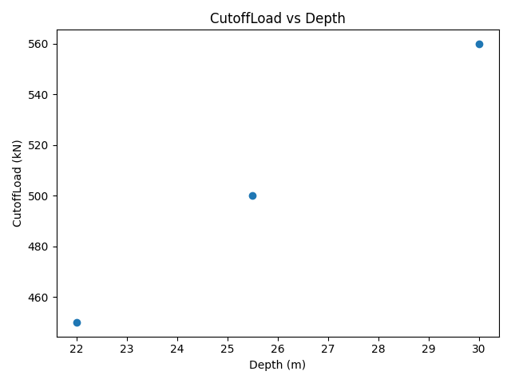

# StructQL

<!-- Replace OWNER/structql below with your actual GitHub path once pushed,
     e.g. shanjeev/structql, so the badge reflects your repo's real CI status. -->


A domain-specific query language for structural engineering datasets — query
CSV exports of bridges, piles, and inspection records the way you'd query a
database, with **engineering units built into the language itself**.

## Why

Structural engineers store inspection, material, and geotechnical data in
spreadsheets. Filtering that data ("find every bridge with concrete strength
below 35MPa") usually means manual Excel filtering or ad-hoc scripts that
throw units away. StructQL treats a quantity like `35MPa` as a first-class
value — not a number that happens to have a unit stapled on afterwards.

## Example

```sql
SELECT * FROM Bridges
WHERE ConcreteStrength < 35MPa AND InspectionDate > 2023
```

```sql
SELECT * FROM Piles
WHERE Depth > 20m
```

```bash
structql query Bridges.csv "SELECT * FROM Bridges WHERE ConcreteStrength < 35MPa" \
  --schema Bridges.schema.json

structql chart Piles.csv "SELECT * FROM Piles WHERE Depth > 20m" \
  --schema Piles.schema.json --x Depth --y CutoffLoad --out piles.png
```

A schema file declares each column's type (`TEXT`, `NUMBER`, or `QUANTITY`):

```json
{
  "table_name": "Bridges",
  "columns": {
    "Name": "TEXT",
    "ConcreteStrength": "QUANTITY",
    "InspectionDate": "NUMBER"
  }
}
```

## Status

✅ v1.1 complete — core query engine (v1.0.0) plus a FastAPI web UI
(v1.1.0). See [Roadmap](#roadmap) and
[Future Work](#explicitly-out-of-scope-v1--future-work) for what's next.

## Getting Started

The `examples/` folder in this repo has real, runnable sample data - the
same data used throughout development. Clone the repo, install, and try it:

```bash
pip install -e .

structql query examples/Bridges.csv \
  "SELECT * FROM Bridges WHERE ConcreteStrength < 35MPa AND InspectionDate > 2023" \
  --schema examples/Bridges.schema.json
```

```
Name               ConcreteStrength  InspectionDate
-----------------  ----------------  --------------
Jesus Lock Bridge  32.0MPa           2024
(1 row)
```

```bash
structql chart examples/Piles.csv "SELECT * FROM Piles WHERE Depth > 20m" \
  --schema examples/Piles.schema.json --x Depth --y CutoffLoad --out piles.png
```

produces:



### Web UI

```bash
pip install -e ".[api]"
structql serve
```

Open `http://127.0.0.1:8000` in a browser: upload a CSV and schema file,
write a query, and run it or generate a chart, without touching the
command line. The web UI is a second transport for the exact same
query pipeline the CLI uses (`engine/executor.py`, `charts/
chart_export.py`) - it adds no query logic of its own.

## Project structure

```
structql/
├── src/structql/
│   ├── domain/          # Core value types: Quantity, Unit, Schema, Row
│   ├── lexer/            # Query string -> tokens
│   ├── parser/            # Tokens -> AST
│   ├── engine/            # AST + storage -> QueryResult (business logic)
│   ├── storage/           # StorageEngine interface + in-memory implementation
│   ├── importers/         # CSV + schema file -> typed rows
│   ├── charts/            # QueryResult -> saved chart image
│   ├── api/                # FastAPI app + static browser frontend
│   ├── cli.py              # Typer commands (query, chart, serve) - thin wiring only
│   └── exceptions.py        # Shared exception hierarchy
├── tests/                 # One test file per module above
├── examples/               # Real, runnable sample data (used in Getting Started)
└── docs/                    # README assets (e.g. the example chart)
```

Each folder under `src/structql/` is a layer with one job (see
[Architecture](#architecture) below) - this mapping from folder to
responsibility is deliberate, not incidental.

## Architecture

```
CSV file (Bridges.csv, Piles.csv)
      │
      ▼
┌──────────────┐   Reads raw strings, applies the table's schema,
│ CSV Importer │   converts "35" + "MPa" into a typed Quantity value.
└──────┬───────┘
       ▼
┌──────────────┐   Typed row storage (in-memory now, file-backed later).
│   Storage    │   The rest of the system depends on this as an
└──────┬───────┘   interface (Protocol), not a concrete implementation.
       ▼
Query string ──▶ Lexer ──▶ Parser ──▶ AST
                                        │
                                        ▼
                                  ┌───────────┐
                                  │  Executor │  Unit-aware WHERE evaluation
                                  └─────┬─────┘  happens here, nowhere else.
                                        ▼
                                  QueryResult
                                        │
                ┌───────────────┬──────┴──────┬───────────────┐
                ▼                ▼             ▼               ▼
         ┌────────────┐  ┌────────────┐  ┌──────────┐  ┌──────────────┐
         │    CLI     │  │   Charts   │  │ FastAPI  │  │ Static HTML  │
         │ (query/    │  │ (matplotlib│  │  (HTTP   │  │  frontend    │
         │  chart)    │  │  → PNG)    │  │  layer)  │  │ (browser UI) │
         └────────────┘  └────────────┘  └────┬─────┘  └──────┬───────┘
                                                └───────────────┘
                                          (API calls Executor + Charts
                                           directly, same as the CLI does)
```

**Design principle:** parsing, execution, and storage are separate modules
that only talk to each other through small interfaces. The CLI, the web
API, and the charting layer all consume a plain `QueryResult` — none of
them know or care whether the data came from CSV, an in-memory table, or
(eventually) a file-backed store. The web UI (`structql serve`) is proof
of this: it's a second transport for the exact same query pipeline the
CLI uses, added without changing a single line in `domain/`, `engine/`,
or `storage/`.

## In scope (v1)

- `CREATE`-free schema: schema is inferred/declared at CSV import time
- `SELECT ... FROM ... WHERE ...` with `=, !=, <, >, <=, >=` and `AND`/`OR`
- Typed values: quantities (`35MPa`, `20m`), bare numbers, quoted strings
- CSV import into typed, queryable tables
- CLI (`structql query <csv> <query> --schema <schema.json>`) - each
  invocation imports the CSV and runs the query within one process, since
  v1 storage is in-memory only (see below)
- Chart export from query results
- Web UI (`structql serve`) - a FastAPI + browser frontend exposing the
  same query/chart pipeline over HTTP, for anyone who'd rather not use
  the command line

## Explicitly out of scope (v1) — Future Work

- JOINs, UPDATE/DELETE, subqueries
- Indexing (v1 does full table scans — fine at this data scale)
- Full date arithmetic (dates are compared as plain years for now)
- Unit conversion between compatible units (e.g. `mm` ↔ `m`) — the type
  system is built to support this later without a redesign

## Development

```bash
pip install -e ".[dev]"
pre-commit install
pytest
```

## Roadmap

- [x] M0 — Repo scaffolding, README spec, CI, pre-commit
- [x] M1 — Domain types (`Quantity`, `Unit`, `Row`, `Schema`)
- [x] M2 — CSV importer
- [x] M3 — Storage layer
- [x] M4 — Lexer
- [x] M5 — Parser
- [x] M6 — Executor
- [x] M7 — CLI
- [x] M8 — Charts
- [x] M9 — Polish, v1.0.0
- [x] M10 — FastAPI web UI, v1.1.0

## License

MIT — see [LICENSE](LICENSE).
